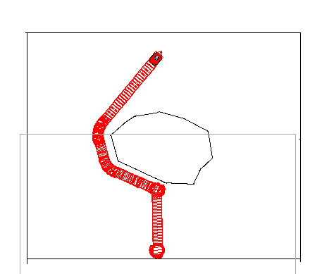
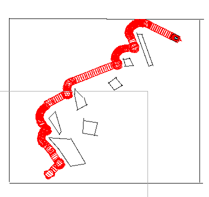

# PleePlee Robot

PleePlee is a proof of concept of a mobile gardener robot.
This repository is about the code for miscellaneous components of the robot.
It contains the code and documentation for:
- the camera
- the LEDs
- the motor driver
- the odometric captors

## Features

The PleePlee robot is able to:
- :seedling: :shower: Water plants.
- :car: Move in a straight line and turn in place.
- :bulb: :satellite: Localize itself in a small area delimited by luminous landmarks.
- :curly_loop: Avoid obstacles.
- :eyes: Log any changes to the garden. (Foreign object or person crossing).

## Core

This repository holds the core code of the robot, that will send orders
to components, recieve the result of these orders, use the location API
and contains the core logic of the robot behavior.

### Obstacles avoidance

For now, we still have problems making the robot move where we want in an accurate manner. So one of our
contributor has implemented all the algorithm based on a distbug algorithm to make this possible. We have tested it
and it works pretty well. The code is in c++ and the simulation has be done with simulink and Aria. You can find bellow screens and results on different maps we have created:

